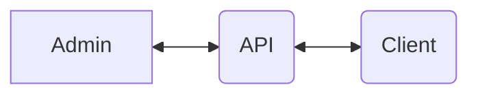

# Components

## Architecture

## API service

This is the main component of the system. All content is created/retrieved through api calls to the API service.
The API service is a [Symfony](https://symfony.com/) project built with [API Platform](https://api-platform.com/).
See [api-service.md](api-service) for further descriptions.
See [security.md](api-service/security) for further description of the security setup.

## Admin

This is where content, connections and screens are created and connected.
[Go to description of admin elements](https://github.com/os2display/display-admin-client#system-description).
The admin is built with [React](https://reactjs.org/).
See [admin.md](admin) for further descriptions.

## Client

This is the output screen where the content will be displayed.
The screen client is built with [React](https://reactjs.org/).
See [client.md](client) for further descriptions.