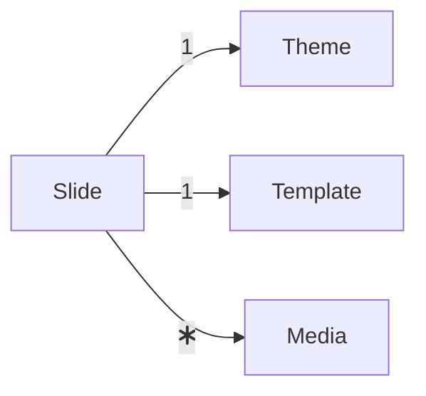
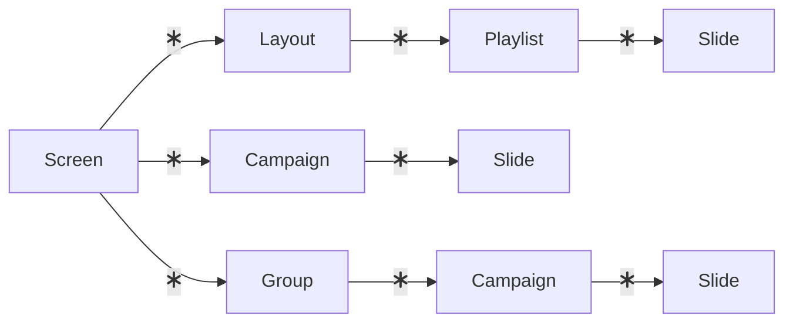

# Content Structure

| Component | Description                                                                                                                                                                                                                                                                                                                                                            | Accessible by |
|-----------|:-----------------------------------------------------------------------------------------------------------------------------------------------------------------------------------------------------------------------------------------------------------------------------------------------------------------------------------------------------------------------|:--------------|
| Slide     | A slide is the visible content on a screen.                                                                                                                                                                                                                                                                                                                            | Admin, editor |
| Media     | Media is either images or videos used as content for slides.                                                                                                                                                                                                                                                                                                           | Admin, editor |
| Theme     | A theme has css, that can override the slide css.                                                                                                                                                                                                                                                                                                                      | Admin         |
| Template  | The template is how the slide looks, and which content is on the slide. Templates are imported from manually and developed outside the admin. Templates are accessible to choose on Slides.                                                                                                                                                                            | Admin, editor |
| Playlist  | A playlist arranges the order of the slides, and the playlist is scheduled.                                                                                                                                                                                                                                                                                            | Admin, editor |
| Campaign  | A campaign is a playlist, that takes precedence over all other playlists on the screen. If there a multiple campaigns, they are queued. A campaign is either directly attached to a screen, or attached to a group affecting the screens that are members of that group. If a campaign applies to a screen it fills the whole screen, not just a region of the screen. | Admin         |
| Group     | A group is a collection of screens.                                                                                                                                                                                                                                                                                                                                    | Admin         |
| Layout    | A layout consists of different regions, and each region can have a number of playlists connected. A layout is connected to a screen.                                                                                                                                                                                                                                   | Admin         |
| Screen    | A screen is connected to an actual screen, and has a layout with different playlists in.                                                                                                                                                                                                                                                                               | Admin         |

## Templates and Screen Layouts

See [templates.md](templates) for a description of how templates work and how to make new.
See [layouts.md](layouts) for a description of how layouts work and how to make new.

## Feeds

See [feeds.md](feeds) for a description of how feeds are set up.

## Scheduling

Scheduling and campaigns will be activated when

* their start time has been reached
* (and) the current playlist has reached its end

to ensure proper transitions.
