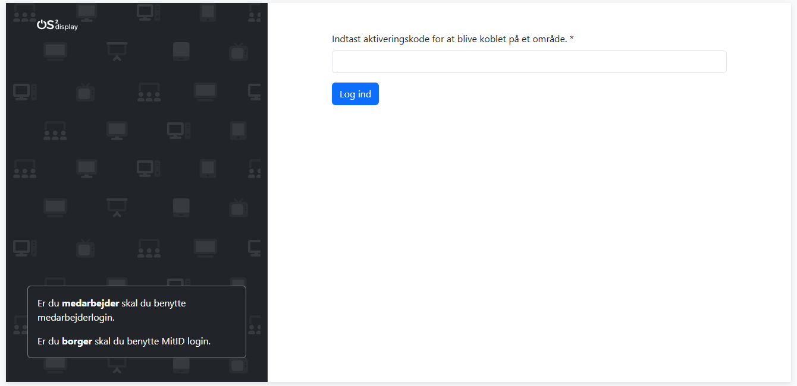

# Brugere

Under menupunktet brugere listes eksterne brugere, som har fået adgang til et område i OS2Display via MitID-login. 

Eksterne brugere er personer, der ikke er ansat i kommunen, og derfor ikke kan tilknyttes via Medarbejder Single Sign On.
Det kan f. eks. være frivillige i et medborgerhus.

> **Generelt om brugeroprettelse** 
> 
> Via OS2Display brugergrænsefladen er det IKKE muligt at oprette ordinære brugere. 
>
> Best practise er at knytte brugere til OS2Display via Medarbejder Single Sign On konfiguration mod Azure/OS2Faktor.
> 
> Det er muligt at oprette brugere manuelt via kommandolinje på serveren, men det er ikke den anbefalede metode til brugeroprettelse.

## Tilknytning af ekstern bruger

Eksterne brugere logger ind i OS2Display med deres MitID. Første gang de logger ind, skal de angive en aktiveringskode, som de har fået tilsendt.

### Opret aktiveringskode til ny ekstern bruger
1. Under **Aktiveringskoder** tryk på **Ny**. 
2. Du kan nu vælge mellem **ekstern bruger** og **ekstern brugeradministrator**. 
  Begge får redaktør-adgang til området, men brugeradministratoren har mulighed for at tilføje nye aktiveringskoder og dermed give adgang til andre eksterne brugere. 
3. En aktiveringskode genereres. Den giver adgang til et område i OS2Display. Aktiveringskoden er **aktiv i to døgn** fra udstedelse og skal manuelt videredistribueres til den person, som skal have ekstern adgang.
4. Når den eksterne bruger har modtaget sin aktiveringskode skal personen logge ind i OS2Display via MitID og så indtaste den unikke kode. Det skal ske inden for to døgn fra oprettelsen af aktiveringskoden.

