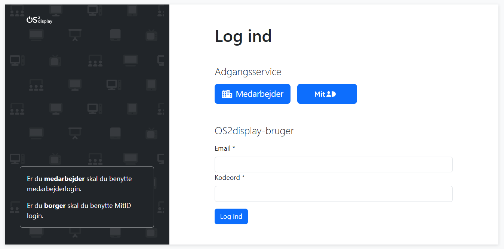

# Log ind siden

Fra log ind-siden kan man tilgå admin-systemet på tre forskellige måder: 

- Medarbejder via Single Sign On (hvis det er opsat). Tryk på knappen **Medarbejder**.  
- Ekstern redaktør via MitID (hvis det er opsat). Tryk på knappen **MitID**
- Bruger oprettet via manuel brugerstyring på installationen. Indtast e-mail og kodeord under **OS2Display-bruger**. 

Læs om eksterne redaktører.  

[Læs om opsætning af Single Sign On](../hosting/sso_setup/sso_setup.html).

Læs om manuel brugerstyring.