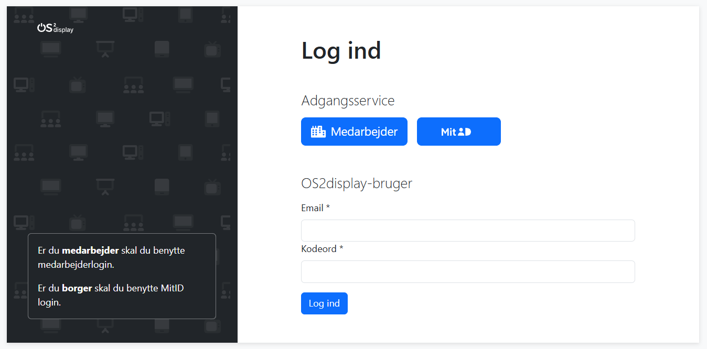

# Log ind siden

Fra log ind-siden kan man tilgå admin-systemet på tre forskellige måder: 

- Medarbejder via Single Sign On (hvis det er opsat). Tryk på knappen **Medarbejder**.  
- Ekstern bruger via MitID (hvis det er opsat). Tryk på knappen **MitID**
- Bruger oprettet via manuel brugerstyring på installationen. Indtast e-mail og kodeord under **OS2Display-bruger**. 

## Generelt om brugeroprettelse

Via OS2Display brugergrænsefladen er det IKKE muligt at oprette ordinære brugere. 

Best practise er at knytte brugere til OS2Display via Medarbejder Single Sign On konfiguration mod Azure/OS2Faktor.

Det er muligt at oprette brugere manuelt via kommandolinje på serveren, men det er ikke den anbefalede metode til brugeroprettelse.

## Relaterede sider:

- [Opsætning af login *Medarbejder* via Single Sign On](../hosting/sso_setup/sso_setup.html).
- [Opsætning af login *MitID* for eksterne brugere]()
- [Administration af eksterne brugere med MitID login](brugere.html)
- [Oprettelse af *OS2Display bruger* via kommandlinje]()