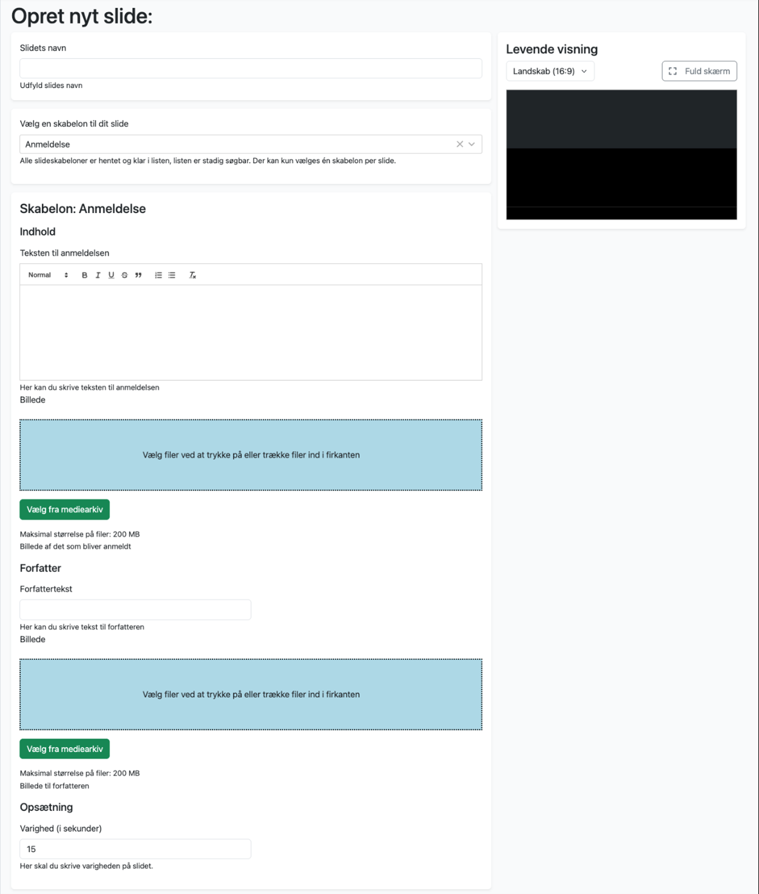

# Anmeldelse

Denne skabelon har tekst til venstre og billede til højre. Den er oprindelig tænkt som en skabelon til anbefaling af bøger på et bibliotek, men kan bruges til alle typer indhold, hvor man ønsker en kortere tekst til venstre på skærmen, suppleret af et billede til højre. 

Skabelonen består af felterne: 

#### Teksten til anmeldelsen 
I denne teksteditor skriver du teksten. Du har adgang til simple værktøjer, der kan forøge tekststørrelse, lave citater, punktopstillinger m.m. 
 

#### Billede 

Her uploader du det billede, der skal vises i feltet til højre i skabelonen (eller vælge det fra mediearkivet). 
 

#### Forfatter 

Dette tekstfelt vises i bunden af slidet, under tekstfeltet ovenfor. Det kan bl.a. bruges til at angive forfatteren af teksten ovenfor, eller til at angive et link hvor man kan læse mere – eller noget helt tredje. 

#### Billede 

Under feltet forfattertekst finder du endnu et billedfelt. Her kan du placere et billede, der knytter sig til indholdet i feltet Forfatter. Det kan fx være et billede af forfatteren, eller et link-ikon eller lignende. Billedet vil blive vist i en lille cirkel, så vælg et enkelt billede eller en grafik, der fungerer godt, selv om den er lille. 

#### Varighed 

Nederst i skabelonen, under Opsætning, angiver du slidets varighed i sekunder.  

|Fakta om skabelonen           | |
|-----------------------------|-----------|
|Systemnavn:                    |book-review  |
|Kræver OS2Display datakilde:   |Nej          |
