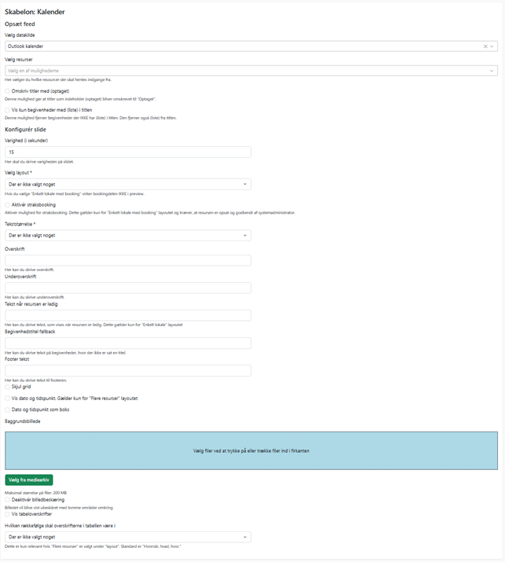

# Kalender
Kalenderskabelonen bruges til at vise, hvad der foregår i lokaler hentet automatisk fra en booking-datakilde. 
Kalender-skabelonen henter data fra en datakilde, fx Exchange. Datakilder skal på forhånd sættes op under **Indstillinger**. Visse af de følgende felter er afhængige af, hvordan datakilden er sat op.

#### Vælg resurser 

Når datakilden er konfigureret, kan man vælge de resurser (lokaler), som er gjort tilgængelige. 

#### Omskriv titler med (optaget), Vis kun begivenheder med (liste) i titlen. 

Det er muligt at afgrænse det antal bookinger, der vises, ved at få OS2Display til at sætte særlige regler op for emnefeltet. Dette skal konfigureres i datakilden. 

#### Layout 

Der er fire tilgængelige layout: 

#### Enkelt lokale 

Viser nuværende og kommende bookings af et lokale. Typisk til en lille skærm, der hænger foran lokalet. 

#### Flere resurser 

Viser dagens bookinger af flere lokaler 

#### Flere resurser flere dage 

Viser begivenheder i udvalgte lokaler de næste 5 dage. 

#### Enkelt lokale med booking 

Et særligt layout som understøtter straks-booking fra skærmen (kræver særlig opsætning af datakilden). 

#### Diverse ekstra layout-muligheder 

I de følgende formularfelter gives diverse muligheder for at ændre i opsætningen af fx rækkefølgen på oplysningerne og visning af dato og tidspunkt. 

|Fakta om skabelonen           | |
|-----------------------------|-----------|
|Kræver OS2Display datakilde: | Ja |
|Kompatible feed output models: |Calendar |
|Kompatible Datakilde Typer: |CalendarAPI, Koba |
