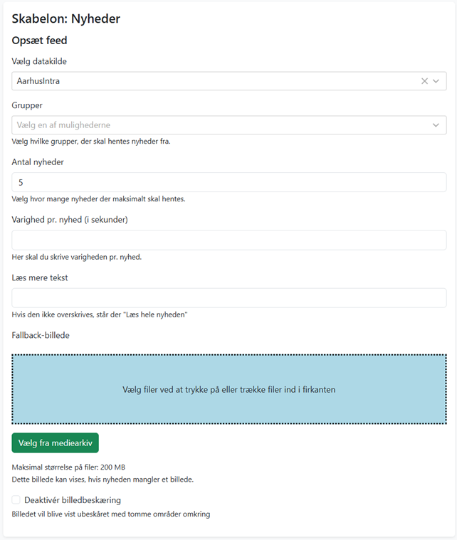

# Nyheder
Skabelonen henter indhold fra en datakilde. Der er pr oktober 2025 integration til intranetsystemet Colibo og RSS-feeds. Billedet vises i 16:9-format. Det er muligt at vælge et fallback-billede, som vises, hvis der ikke er angivet et billede i API/RSS. 

Colibo-datakilden giver mulighed for at vise et antal nyheder fra udvalgte organisationsenheder. 

|Fakta om skabelonen           | |
|-----------------------------|-----------|
|Systemnavn:                    |news-feed  |
|Kræver OS2Display datakilde: |Ja  |
|Kompatible feed output models: |RSS  |
|Kompatible Datakilde Typer: |Colibo, RSS  |

