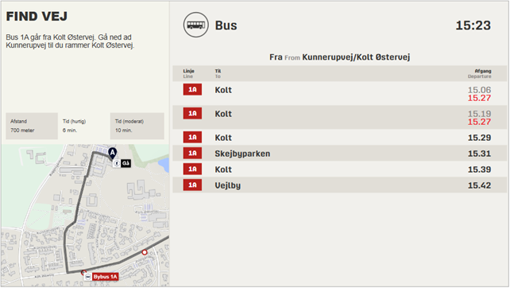

# Rejseplanen

Man skal have en aftale med Rejseplanen. (Hvordan foregår det?) 

Rejseplanen henter afgange fra et stoppested ind i en iframe på skærmen. Skabelonen påvirkes af skærmens opløsning, så teksten vil være mindre på en skærm i 4K end HD. 

Første halvdel af skabelonen er fritekstfelter, som ikke vil blive vist, hvis man ikke udfylder felterne. Under billede-valget henter man oplysninger fra Rejseplanen. 

Du skal kende stoppestedets navn – der søges i stoppesteder for hele landet. Stoppestederne vil have to enslydende navne, ét for hver retning. 

Udfylder man alle felter vil skærmbilledet se således ud på en HD-skærm: 

Hvis man ikke udfylder de indledende fritekst-felter forsvinder feltet til venstre. 

---

|Fakta om skabelonen           | |
|-----------------------------|-----------|
|Systemnavn:                    |travel  |
|Kræver OS2Display datakilde:   |Nej          |
