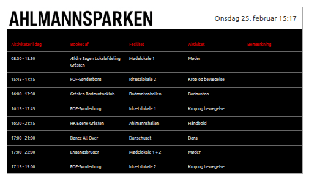
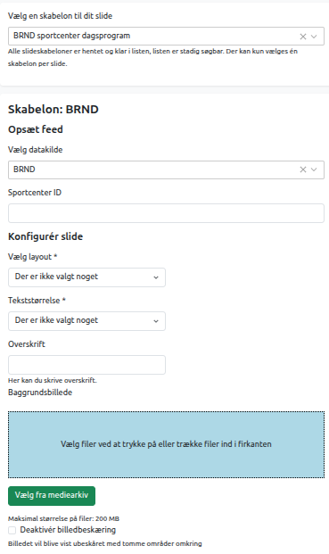

# BRND booking

BRND (nu formelt BRND ApS) er en dansk it-virksomhed, der leverer en omfattende forretningsplatform til booking og ressourceadministration. Systemet bruges især af kommuner, foreninger og idrætsanlæg til at håndtere udlejning af lokaler, baner og faciliteter.

BRND booking skabelonen integrerer til BRNDS system og kan bruges til at vise en oversigt over bookinger i et idrætsanlæg.

BRND booking skabelonen kan kun bruges af kommuner, der er kunder hos BRND ApS.

## Felter i BRND-skabelonen

#### Vælg datakilde
Vælg BRND

#### Sportcenter ID
Her indtastes ID nøgle for et Sportcenter. ID-nøgler skal rekvireres hos BRND.

#### Vælg layout
Der kan pt. kun vælges layoutet "Sportcenter Dagsprogram"

#### Tekststørrelse
Vælg størrelse på skriften

#### Overskrift
Tilføj en overskrift øverst på slide. Ikke påkrævet.

#### Baggrundsbillede
Upload et billede. Placeres som et logo i øverste venstre hjørne. Ikke påkrævet.

|Fakta om skabelonen           | |
|-----------------------------|-----------|
|Kræver OS2Display datakilde: | Ja |
|Kompatible feed output models: |brnd-booking |
|Kompatible Datakilde Typer: |BRND|

