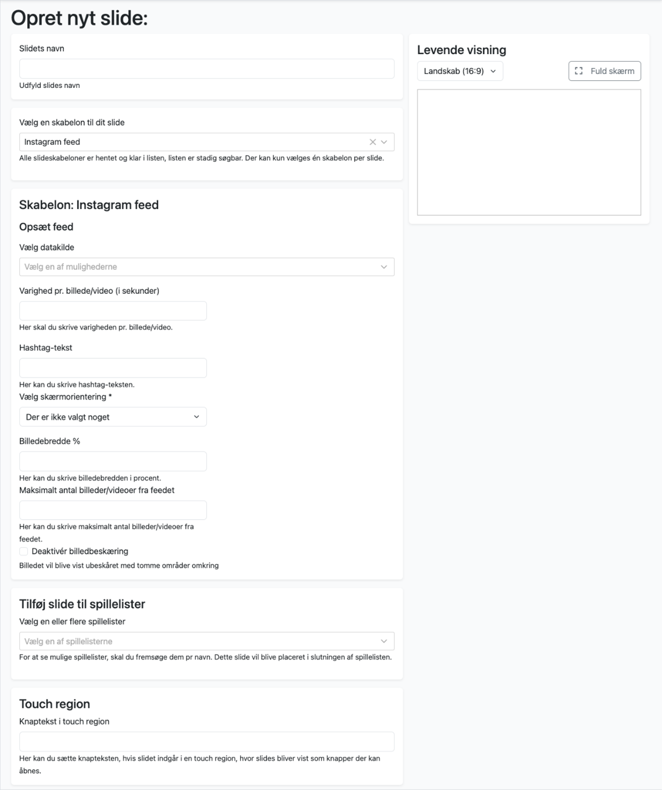

# Instagram Feed

Denne skabelon forudsætter abonnement hos Notified.com - en platform, der bl.a. giver mulighed for at udvælge og moderere indhold fra sociale medier, der kan udstilles på andre platforme via API. 

Når man har et abonnement med adgang til API, kan du med denne skabelon vise indhold fra eksempelvis Instagram på skærme vha. OS2display. 

|Fakta om skabelonen           | |
|-----------------------------|-----------|
|Systemnavn:                            |instagram-feed  |
|Kræver OS2Display datakilde:           |Ja              |
|Kompatible feed output models:         |Instagram       |
|Kompatible Datakilde Typer:            |Notified        |
