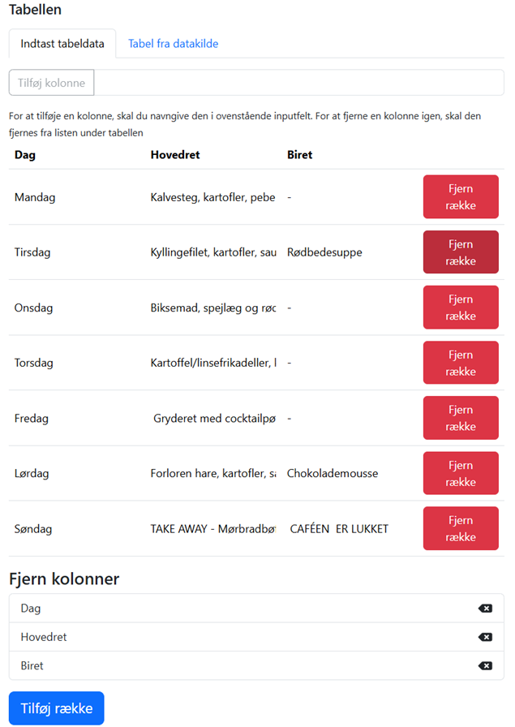

# Tabel
Skabelonen gør det muligt at opsætte indhold i en tabel. Først tilføjes kolonner ved at skrive kolonneoverskriften og trykke på **tilføj kolonne**. Dernæst Tilføjes rækker ved at trykke på **tilføj række**. Det er nu muligt at skrive indhold direkte i tabellen. Der SKAL være et tegn i hver celle – ellers forrykker tabellen sig. Så indsæt en bindestreg eller lignende, hvis cellen skal være tom. 

|Fakta om skabelonen           | |
|-----------------------------|-----------|
|Systemnavn:                    |table  |
|Kræver OS2Display datakilde:   |Nej          |
